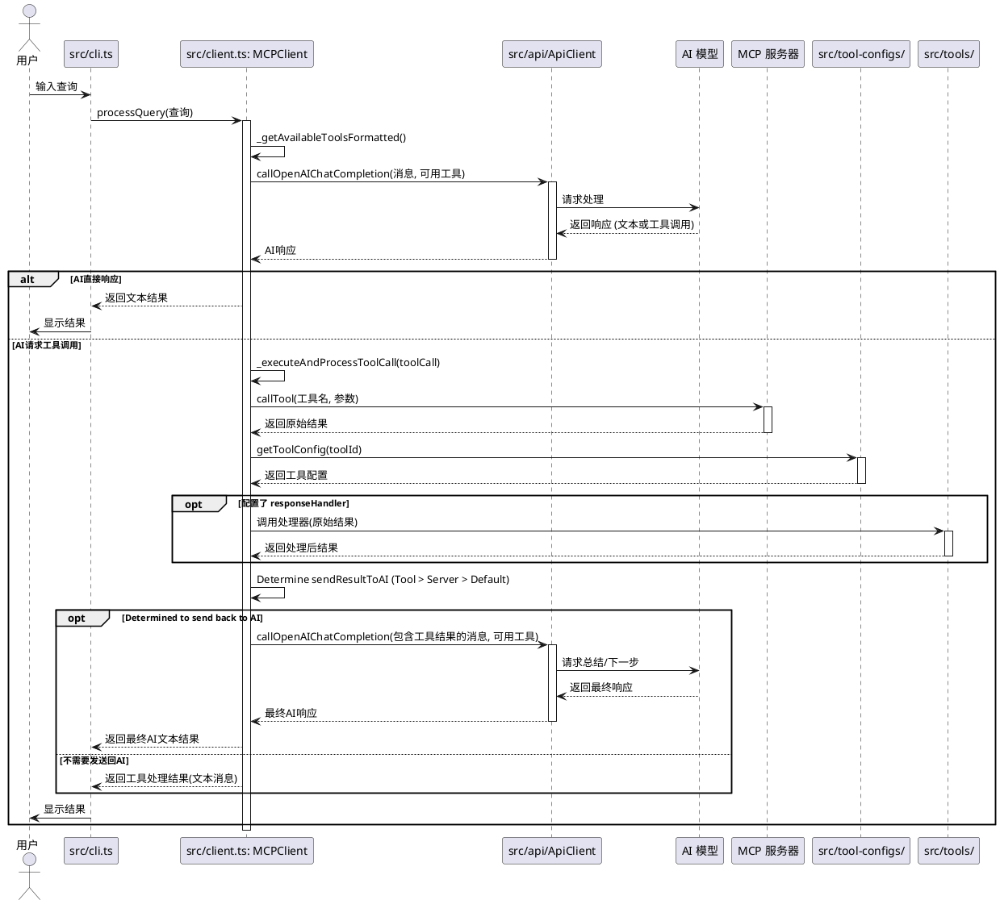

## MCP 客户端 (mcp-client) 操作文档

### 1. 简介

本项目 (`mcp-client`) 是一个用于与 **模型上下文协议 (Model Context Protocol - MCP)** 服务器交互的客户端应用程序。它允许用户通过命令行界面发送查询，利用配置的 AI 模型（如 DeepSeek）来理解查询意图，并调用连接的 MCP 服务器上注册的工具来完成任务。客户端支持连接多个 MCP 服务器，并能根据需要处理工具的输出，例如保存文件或将结果返回给 AI 进行总结。

### 2. 项目结构概览

```
mcp-client/
├── mcp-server-config.ts    # MCP 服务器连接配置文件
├── tsconfig.json           # TypeScript 编译器配置
├── package.json            # 项目依赖和脚本定义
├── pnpm-lock.yaml          # pnpm 锁文件
├── .env                    # 环境变量文件 (存储 API 密钥等)
├── examples/               # 示例代码
│   └── demo.ts            # 演示示例代码
├── src/
│   ├── client.ts           # 定义核心 MCPClient 类
│   ├── types.ts            # 项目共享的 TypeScript 类型定义
│   ├── cli.ts              # 命令行界面入口和交互逻辑
│   ├── api/                # API 相关实现
│   │   └── ApiClient.ts    # 封装对外部 API (如 DeepSeek/OpenAI) 的调用
│   ├── storage/            # 存储相关实现
│   │   └── index.ts        # 存储模块导出
│   ├── tools/              # 工具响应处理器相关代码
│   │   ├── index.ts        # 工具处理器注册和导出
│   │   ├── utils.ts        # 工具响应处理相关的工具函数
│   │   └── [tool_name]/    # 特定工具的处理器
│   │       └── handler.ts  # 工具的具体处理逻辑
│   └── tool-configs/       # 工具的详细配置文件
│       ├── index.ts        # 聚合和导出所有工具配置
│       ├── utils/          # 工具配置相关的工具函数
│       └── [tool_name]/    # 特定工具的配置
│           └── config.ts   # 工具的具体配置
├── outputs/                # (运行时生成) 默认的输出目录
│   ├── transcripts/        # 保存字幕的子目录
│   └── ...                 # 其他根据工具配置生成的输出
├── build/                  # (编译后生成) JavaScript 输出目录
└── node_modules/           # 项目依赖
```

**主要组件说明:**

*   **`src/cli.ts`:** 负责启动应用、处理命令行参数、运行交互式查询循环。
*   **`examples/demo.ts`:** 包含演示示例代码，用于展示客户端功能。
*   **`src/client.ts (MCPClient)`:** 核心类，管理与 MCP 服务器的连接、会话、加载工具配置、编排查询处理流程。
*   **`src/api/ApiClient.ts`:** 负责与外部 AI 服务（如 DeepSeek/OpenAI 兼容 API）通信。
*   **`src/storage/`:** 定义和实现存储逻辑。
*   **`src/tools/`:** 包含处理特定工具响应的自定义逻辑。主要负责：
    * 处理工具执行后的原始响应
    * 格式化输出
    * 提供工具响应处理相关的工具函数
*   **`src/tool-configs/`:** 定义每个工具的配置，主要负责：
    * 定义工具的描述和行为标志
    * 配置工具的执行参数
    * 指定是否保存输出或发送结果给 AI
*   **`mcp-server-config.ts`:** 配置客户端应连接的 MCP 服务器列表及其连接方式。
*   **`src/types.ts`:** 定义整个项目中使用的 TypeScript 接口和类型。

### 3. 工具处理流程

工具的处理流程涉及两个主要组件：`tools/` 和 `tool-configs/`。它们各自负责不同的职责：

1. **工具配置 (`tool-configs/`)**:
   - 定义工具的基本信息（名称、描述等）
   - 配置工具的行为（如 `saveOutput`、`sendResultToAI`）
   - 指定工具的参数和验证规则
   - 可以引用 `tools/` 中的处理器

2. **工具处理器 (`tools/`)**:
   - 处理工具执行后的原始响应
   - 格式化输出为用户友好的格式
   - 处理错误情况
   - 可以保存输出到文件系统
   - 可以发送处理后的结果给 AI 进行总结

这种分离的设计使得：
- 工具配置可以独立于处理逻辑进行修改
- 同一个工具可以有多个不同的处理器
- 处理器可以被多个工具配置复用
- 配置和处理的职责清晰分离

### 4. 架构图与处理流程

以下使用 PlantUML 序列图展示了用户查询的处理流程，并附有详细的文字解释：



**处理流程详细说明：**

1. **用户输入阶段**:
   - 用户在命令行界面 (`src/cli.ts`) 输入查询
   - CLI 将查询传递给 `MCPClient` 实例进行处理

2. **AI 处理阶段**:
   - `MCPClient` 准备消息历史，获取可用工具列表
   - 通过 `ApiClient` 将消息和工具列表发送给 AI 模型
   - AI 返回响应，可能是直接回答或工具调用请求

3. **工具执行阶段**:
   - 如果 AI 请求调用工具，`MCPClient` 执行以下步骤：
     a. 向对应的 MCP 服务器发送工具调用请求
     b. 获取工具配置 (`tool-configs/`) - 如果存在特定配置的话
     c. 如果获取到了特定配置且该配置指定了响应处理器，则调用对应的处理器 (`tools/`)
     d. **根据优先级决定是否将结果发送回 AI：**
        - **优先**检查特定工具配置 (`ToolConfig`) 中的 `sendResultToAI` 标志。
        - 如果特定工具配置未设置此标志，则检查对应服务器配置 (`ServerConfig`) 中的 `sendResultToAI` 标志。
        - 如果两者都未设置，则默认为 `false` (不发送)。

4. **结果处理阶段**:
   - 如果根据上述规则确定需要 AI 总结，则将工具结果发送回 AI 进行最终处理。

5. **关键组件交互**:
   - `MCPClient`: 核心协调者，管理整个流程
   - `ApiClient`: 处理与 AI 模型的通信
   - `tool-configs/`: 提供工具配置
   - `tools/`: 处理工具响应
   - `MCP 服务器`: 执行实际工具操作

这种架构设计实现了：
- 清晰的职责分离
- 灵活的配置管理
- 可扩展的工具处理
- 智能的结果处理

### 5. 环境准备

在开始之前，请确保你的开发环境满足以下要求：

*   **Node.js:** 建议使用较新的 LTS 版本 (e.g., v18 或 v20+)。
*   **pnpm:** 项目使用 pnpm 作为包管理器。如果尚未安装，可以通过 `npm install -g pnpm` 安装。
*   **API 密钥和敏感配置:**
    *   在项目根目录下创建一个 `.env` 文件 (如果它还不存在)。
    *   **重要:** `.env` 文件已在 `.gitignore` 中配置，请**不要**将此文件提交到版本控制系统 (如 Git)。
    *   在 `.env` 文件中设置必要的环境变量。至少需要 DeepSeek 的 API 密钥。如果需要使用 `evm-mcp-server`，还需要配置其私钥和 RPC URL：
        ```dotenv
        # AI 模型配置
        DEEPSEEK_API_KEY=your_deepseek_api_key
        # DEEPSEEK_API_BASE=https://api.deepseek.com/v1 # (可选, 如果需要指定)
        # OPENAI_API_KEY=your_openai_api_key # (可选, 如果需要直接使用 OpenAI)
        # OPENAI_API_BASE=... # (可选)
        
        # EVM 相关服务器配置 (如果启用 evm-mcp-server)
        EVM_WALLET_PRIVATE_KEY=your_wallet_private_key_here
        EVM_RPC_PROVIDER_URL=your_rpc_provider_url_here
        ```
       客户端默认使用 `DEEPSEEK_API_KEY` 和 `DEEPSEEK_API_BASE`（如果提供）来初始化与 AI 模型的交互。
       `evm-mcp-server` 的配置 (`mcp-server-config.ts`) 现在会读取 `EVM_WALLET_PRIVATE_KEY` 和 `EVM_RPC_PROVIDER_URL`。

### 6. 项目设置与启动

1.  **安装依赖:** 在项目根目录下运行：
    ```bash
    pnpm install
    ```
2.  **编译项目 (如果需要):** 如果代码有更改或者尚未编译，运行：
    ```bash
    pnpm build
    ```
3.  **启动客户端:**
    客户端支持两种启动模式（由 **`src/cli.ts`** 处理）：

   *   **配置文件模式 (默认):**
       此模式会读取 `mcp-server-config.ts` 文件，并尝试连接其中 `isOpen: true` 的所有服务器。
       ```bash
       pnpm start
       ```
       客户端启动后，会自动连接配置的服务器，发现并注册工具，然后进入交互式查询模式。

   *   **命令行模式:**
       此模式用于直接启动并连接到一个指定的 MCP 服务器脚本（例如 Python 或 JavaScript 服务端脚本）。
       ```bash
       pnpm start /path/to/your/server_script.js
       # 或者
       pnpm start /path/to/your/server_script.py
       ```
       客户端会使用指定的脚本启动一个 MCP 服务实例，连接它，发现工具，然后进入交互式查询模式。

4.  **交互式查询:**
    启动成功后，你会看到类似以下的提示：
    ```
    MCP Client Started!
    Type your queries or 'quit' to exit.

    Query:
    ```
    输入你的查询，客户端 (`MCPClient` 类，位于 `src/client.ts`) 会调用 AI 判断是否需要使用工具，执行工具，并返回结果。输入 `quit` 退出客户端。

### 7. 添加新的 MCP 服务器

要让客户端能够连接到一个新的 MCP 服务器，你需要修改根目录下的 **`mcp-server-config.ts`** 文件。

此文件导出一个包含服务器配置对象的数组。每个对象代表一个服务器连接。

**服务器配置对象结构:** (`ServerConfig` in `src/types.ts`)

*   `name` (string): 服务器的唯一名称（例如 'youtube-service', 'browser-tools'）。
*   `type` ('command' | 'sse'): 连接类型。
   *   `'command'`: 客户端将通过执行本地命令来启动和通信。
   *   `'sse'`: 客户端将通过 Server-Sent Events (SSE) 连接到一个运行中的 URL。
*   `command` (string, 可选): 当 `type` 为 `'command'` 时必需。指定启动服务器的完整命令（例如 `python3 path/to/server.py` 或 `node path/to/server.js`）。
*   `url` (string, 可选): 当 `type` 为 `'sse'` 时必需。指定服务器的 SSE 端点 URL。
*   `isOpen` (boolean): 是否让客户端在启动时（默认模式下）自动尝试连接此服务器。设置为 `true` 以启用。

**示例:**

```javascript:mcp-server-config.ts
const config = [
  {
    name: "youtube-transcript",
    type: "command",
    command: "npx",
    args: ["-y", "@sinco-lab/mcp-youtube-transcript"],
    isOpen: true
  },
  {
    name: "evm-mcp-server",
    type: "command",
    command: "npx",
    args: ["-y", "@sinco-lab/evm-mcp-server"],
    isOpen: true
  },
  {
    name: "remote-sse-service",
    type: "sse",                  // 类型：通过 SSE 连接
    url: "http://example.com/sse", // SSE 服务器 URL
    isOpen: false                 // 启动时默认不连接
  }
  // ... 可以添加更多服务器配置
];

export default config;
```

添加或修改配置后，以**配置文件模式**重新启动客户端即可应用更改。

### 8. 配置工具行为（保存输出/AI总结）

工具的具体行为可以在 **`src/tool-configs/`** 目录下的对应配置文件中定义。每个工具通常有一个 `.ts` 文件，例如 `src/tool-configs/youtube/transcript.ts`。

这些配置文件使用 `createToolConfig` 工厂函数（来自 **`src/tool-configs/utils/configFactory.js`**）来创建配置对象。

**工具配置对象结构:** (`ToolConfig` in `src/types.ts`)

*   `name` (string): 工具的名称（例如 'get_transcripts'）。
*   `description` (string, 可选): 工具的描述，主要供 AI 理解工具的功能。
*   `systemPrompt` (string, 可选): 调用此工具时可以使用的特定系统提示。
*   `responseHandler` (function, 可选): 一个自定义函数，用于处理从 MCP 服务器返回的原始工具结果。需要返回一个 `ToolResponse` 对象。
*   `saveOutput` (boolean, 可选): 如果设置为 `true`，客户端 (`MCPClient` 类) 将尝试保存工具的输出。这通常需要 `responseHandler` 返回包含文件路径的 `ToolResponse` 对象。
*   `sendResultToAI` (boolean, 可选): 控制在工具执行成功（或失败）后，其结果（或错误信息）是否被发送回 AI 模型。
    *   如果特定工具配置中明确设置了此项 (为 `true` 或 `false`)，则以工具配置为准。
    *   如果特定工具配置中**未设置**此项，则会查找对应服务器配置 (`mcp-server-config.ts` 中 `ServerConfig`) 的 `sendResultToAI` 标志作为默认值。
    *   如果服务器配置中也未设置，则默认为 `false` (不发送)。
    *   设置为 `true` 时，结果将被格式化并发送回 AI，让 AI 可以基于工具结果进行总结、解释或下一步操作。

**示例：给 YouTube 字幕工具添加保存和 AI 总结功能**

假设我们要修改 `src/tool-configs/youtube/transcript.ts`：

```typescript:src/tool-configs/youtube/transcript.ts
import { createToolConfig } from '../utils/configFactory.js';
import { getToolHandler } from '../../tools/index.js';

/**
 * YouTube 字幕工具配置
 */
const youtubeTranscriptTool = createToolConfig(
    'youtube-transcript', // 服务器名称部分 (应与 mcp-server-config.ts 中一致)
    'get_transcripts',    // 工具名称 (服务器上注册的名称)
    {
        description: '获取和处理 YouTube 视频字幕',
        systemPrompt: '你是一个能够获取 YouTube 视频字幕并提供摘要的助手。',
        
        // 启用保存输出
        saveOutput: true, 
        
        // 启用 AI 总结/处理
        sendResultToAI: true, 
        
        // 指定响应处理器 (可选, 但对于保存和复杂处理通常是必要的)
        // 这个处理器需要从 src/tools/index.ts 导出
        responseHandler: getToolHandler('youtube-transcript__get_transcripts') 
    }
);

export default youtubeTranscriptTool;
```

**说明:**

1.  **`saveOutput: true`:**
   *   当设置此项时，`src/client.ts` 中的 `processToolResponse` 方法会检查此标志。
   *   **重要:** 要使保存生效，你的 `responseHandler` (如果定义了) **必须** 返回一个包含 `paths` 字段的 `ToolResponse` 对象，例如：
       ```typescript
       // In your response handler (e.g., src/tools/youtube/transcriptHandler.ts)
       import { createToolResponse } from '../utils.js';
       import { storage } from '../../storage'; // Assuming storage is accessible
       // ...
       const result = await processTranscript(content); // Your logic
       const savedFilePath = await storage.save('transcript.txt', result.text); // Save using storage handler
       return createToolResponse({
           message: "字幕已处理并保存。",
           paths: { 'text': savedFilePath }, // Provide the path
           rawContent: result // Original processed content
       });
       ```
   *   如果没有 `responseHandler`，默认行为可能不会保存文件，除非服务器直接返回适合保存的简单字符串或 JSON。

2.  **`sendResultToAI: true`:**
   *   `processQuery` 方法会收集所有确定需要发送回 AI 的工具结果，并在第一轮工具调用完成后，将这些结果连同之前的对话历史一起，再次发送给 AI (`_callAIForProcessing`)。
   *   AI 接收到工具结果后，可以进行总结、解释，或根据这些信息决定下一步行动。最终的 AI 回复会显示给用户。

**请注意：** `responseHandler` 的执行与 `sendResultToAI` 的判断是独立的。如果配置了 `responseHandler`，它总会在工具返回原始结果后被调用。`sendResultToAI` 的最终值（根据工具或服务器配置决定）仅控制是否将工具执行的最终结果（可能是原始结果，也可能是 Handler 处理后的结果）发送回 AI 模型进行后续处理。

修改完工具配置后，重新编译 (如果需要) 并重新启动客户端即可生效。

### 9. (可选) 添加自定义工具响应处理

如果简单的保存或 AI 总结不够，你需要更复杂的逻辑来处理特定工具的响应（例如，格式化输出、从结果中提取特定信息、调用其他本地函数等），可以执行以下步骤：

1.  **创建处理函数:** 在 **`src/tools/`** 下的相应子目录（或新的子目录）中创建一个处理函数。这个函数接收工具返回的原始 `content` 作为参数，并应返回一个 `ToolResponse` 对象 (可以使用 `src/tools/utils.ts` 中的 `createToolResponse` 或 `validateToolResponse`)。
    ```typescript:src/tools/mytool/myHandler.ts
    import { ToolResponse } from '../../types.js';
    import { createToolResponse } from '../utils.js';

    export async function handleMyToolResponse(content: any): Promise<ToolResponse> {
      // 你的处理逻辑...
      const processedData = ...;
      const userMessage = `处理完成: ${processedData.summary}`;
      
      return createToolResponse({
        message: userMessage,
        rawContent: processedData
      });
    }
    ```
2.  **注册处理函数:** 在 **`src/tools/index.ts`** 中导入并注册你的处理函数。确保键名与工具的完整 ID (`serverName__toolName`) 匹配。
    ```typescript:src/tools/index.ts
    import { handleYoutubeTranscript } from './youtube/transcriptHandler.js';
    import { handleMyToolResponse } from './mytool/myHandler.js'; // 导入你的处理器
    // ... 其他导入和 wrapToolHandler ...

    export const toolHandlers: ToolHandlers = {
      'youtube-transcript__get_transcripts': wrapToolHandler(handleYoutubeTranscript),
      'my-server__my-tool': wrapToolHandler(handleMyToolResponse), // 注册你的处理器
      // ...
    };

    // ... getToolHandler ...
    ```
3.  **配置工具使用处理器:** 在 **`src/tool-configs/`** 目录下的对应配置文件中，将 `responseHandler` 设置为你的处理函数。